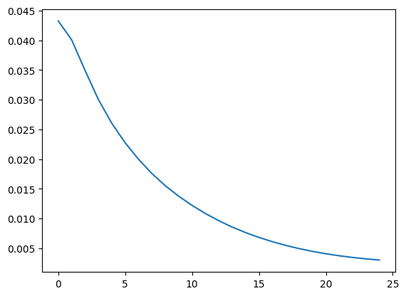

**Table of contents**<a id='toc0_'></a>    
- [data cleaning](#toc1_)    
  - [좋은 데이터란](#toc1_1_)    
    - [completeness](#toc1_1_1_)    
    - [uniqueness](#toc1_1_2_)    
    - [accuracy](#toc1_1_3_)    
      - [relational outlier](#toc1_1_3_1_)    
  - [수료증](#toc1_2_)    

<!-- vscode-jupyter-toc-config
	numbering=false
	anchor=true
	flat=false
	minLevel=1
	maxLevel=6
	/vscode-jupyter-toc-config -->
<!-- THIS CELL WILL BE REPLACED ON TOC UPDATE. DO NOT WRITE YOUR TEXT IN THIS CELL -->

# <a id='toc1_'></a>[data cleaning](#toc0_)

- garbage in garbage out
- 아무리 좋은 방법을 써도 데이터가 쓰레기면 의미 없고 데이터 품질이 떨어질수록 분석 과정이 급격하게 힘들어지고 결과가 의미를 갖기도 어렵다
- 그런 의미에서 데이터의 품질과 전처리가 가장 중요하다
- 어떤 데이터가 좋은 데이터인지 판단 할 수 있고 좋게 가공할 수 있어야 한다

## <a id='toc1_1_'></a>[좋은 데이터란](#toc0_)
---

- 완결성 completeness: 필수 항목은 꼭 있어야 한다(결측값 NaN not a number 없어야 한다)
- 유일성 uniqueness: 중복값이 있으면 수정할 때 놓칠 수 있다
- 통일성 conformity: 형식이 통일 되어야 한다 하나의 형식에 부합해야 한다
- 정확성 accuracy: 정확해야 한다


https://www.collibra.com/us/en/blog/the-6-dimensions-of-data-quality


```python
import pandas as pd
import seaborn as sns
```


```python
sam = pd.read_csv('attendance.csv')
sam
```


<div>
<style scoped>
    .dataframe tbody tr th:only-of-type {
        vertical-align: middle;
    }

    .dataframe tbody tr th {
        vertical-align: top;
    }

    .dataframe thead th {
        text-align: right;
    }
</style>
<table border="1" class="dataframe">
  <thead>
    <tr style="text-align: right;">
      <th></th>
      <th>연도</th>
      <th>야구</th>
      <th>축구</th>
      <th>배구</th>
      <th>남자농구</th>
      <th>여자농구</th>
    </tr>
  </thead>
  <tbody>
    <tr>
      <th>0</th>
      <td>2008</td>
      <td>10881</td>
      <td>11642</td>
      <td>1253.0</td>
      <td>4208</td>
      <td>1329</td>
    </tr>
    <tr>
      <th>1</th>
      <td>2009</td>
      <td>11562</td>
      <td>10983</td>
      <td>1471.0</td>
      <td>4152</td>
      <td>1206</td>
    </tr>
    <tr>
      <th>2</th>
      <td>2010</td>
      <td>11402</td>
      <td>12873</td>
      <td>NaN</td>
      <td>3870</td>
      <td>705</td>
    </tr>
    <tr>
      <th>3</th>
      <td>2011</td>
      <td>13055</td>
      <td>10709</td>
      <td>1774.0</td>
      <td>3955</td>
      <td>1445</td>
    </tr>
    <tr>
      <th>4</th>
      <td>2012</td>
      <td>13747</td>
      <td>7157</td>
      <td>NaN</td>
      <td>4537</td>
      <td>1150</td>
    </tr>
    <tr>
      <th>5</th>
      <td>2013</td>
      <td>11373</td>
      <td>7656</td>
      <td>NaN</td>
      <td>4092</td>
      <td>1237</td>
    </tr>
    <tr>
      <th>6</th>
      <td>2014</td>
      <td>11429</td>
      <td>8115</td>
      <td>1967.0</td>
      <td>4458</td>
      <td>1417</td>
    </tr>
    <tr>
      <th>7</th>
      <td>2015</td>
      <td>10357</td>
      <td>7720</td>
      <td>2311.0</td>
      <td>3953</td>
      <td>1480</td>
    </tr>
    <tr>
      <th>8</th>
      <td>2016</td>
      <td>11583</td>
      <td>7854</td>
      <td>2336.0</td>
      <td>3543</td>
      <td>1425</td>
    </tr>
    <tr>
      <th>9</th>
      <td>2017</td>
      <td>11668</td>
      <td>6502</td>
      <td>2425.0</td>
      <td>3188</td>
      <td>1097</td>
    </tr>
  </tbody>
</table>
</div>


```python
sam.isnull()
```


<div>
<style scoped>
    .dataframe tbody tr th:only-of-type {
        vertical-align: middle;
    }

    .dataframe tbody tr th {
        vertical-align: top;
    }

    .dataframe thead th {
        text-align: right;
    }
</style>
<table border="1" class="dataframe">
  <thead>
    <tr style="text-align: right;">
      <th></th>
      <th>연도</th>
      <th>야구</th>
      <th>축구</th>
      <th>배구</th>
      <th>남자농구</th>
      <th>여자농구</th>
    </tr>
  </thead>
  <tbody>
    <tr>
      <th>0</th>
      <td>False</td>
      <td>False</td>
      <td>False</td>
      <td>False</td>
      <td>False</td>
      <td>False</td>
    </tr>
    <tr>
      <th>1</th>
      <td>False</td>
      <td>False</td>
      <td>False</td>
      <td>False</td>
      <td>False</td>
      <td>False</td>
    </tr>
    <tr>
      <th>2</th>
      <td>False</td>
      <td>False</td>
      <td>False</td>
      <td>True</td>
      <td>False</td>
      <td>False</td>
    </tr>
    <tr>
      <th>3</th>
      <td>False</td>
      <td>False</td>
      <td>False</td>
      <td>False</td>
      <td>False</td>
      <td>False</td>
    </tr>
    <tr>
      <th>4</th>
      <td>False</td>
      <td>False</td>
      <td>False</td>
      <td>True</td>
      <td>False</td>
      <td>False</td>
    </tr>
    <tr>
      <th>5</th>
      <td>False</td>
      <td>False</td>
      <td>False</td>
      <td>True</td>
      <td>False</td>
      <td>False</td>
    </tr>
    <tr>
      <th>6</th>
      <td>False</td>
      <td>False</td>
      <td>False</td>
      <td>False</td>
      <td>False</td>
      <td>False</td>
    </tr>
    <tr>
      <th>7</th>
      <td>False</td>
      <td>False</td>
      <td>False</td>
      <td>False</td>
      <td>False</td>
      <td>False</td>
    </tr>
    <tr>
      <th>8</th>
      <td>False</td>
      <td>False</td>
      <td>False</td>
      <td>False</td>
      <td>False</td>
      <td>False</td>
    </tr>
    <tr>
      <th>9</th>
      <td>False</td>
      <td>False</td>
      <td>False</td>
      <td>False</td>
      <td>False</td>
      <td>False</td>
    </tr>
  </tbody>
</table>
</div>


```python
sam.isnull().sum()
```


    연도      0
    야구      0
    축구      0
    배구      3
    남자농구    0
    여자농구    0
    dtype: int64


### <a id='toc1_1_1_'></a>[completeness](#toc0_)

만약 결측치를 다시 채워넣을 수 없다면,
- 레코드를 지우거나(인덱스)
- 칼럼을 날리거나
- 결측값만 대체하거나
  - 0으로
  - 평균, 중간값으로
  - mean normalization
    - 결측치는 행의 평균값을 부여하고 행의 모든 값에서 다시 행의 평균값을 차감
    - 결측치는 0이 되고 다른 값은 평균으로부터의 거리로 표현된다


```python
sam.dropna() #필요하면 inplace=True로
```


<div>
<style scoped>
    .dataframe tbody tr th:only-of-type {
        vertical-align: middle;
    }

    .dataframe tbody tr th {
        vertical-align: top;
    }

    .dataframe thead th {
        text-align: right;
    }
</style>
<table border="1" class="dataframe">
  <thead>
    <tr style="text-align: right;">
      <th></th>
      <th>연도</th>
      <th>야구</th>
      <th>축구</th>
      <th>배구</th>
      <th>남자농구</th>
      <th>여자농구</th>
    </tr>
  </thead>
  <tbody>
    <tr>
      <th>0</th>
      <td>2008</td>
      <td>10881</td>
      <td>11642</td>
      <td>1253.0</td>
      <td>4208</td>
      <td>1329</td>
    </tr>
    <tr>
      <th>1</th>
      <td>2009</td>
      <td>11562</td>
      <td>10983</td>
      <td>1471.0</td>
      <td>4152</td>
      <td>1206</td>
    </tr>
    <tr>
      <th>3</th>
      <td>2011</td>
      <td>13055</td>
      <td>10709</td>
      <td>1774.0</td>
      <td>3955</td>
      <td>1445</td>
    </tr>
    <tr>
      <th>6</th>
      <td>2014</td>
      <td>11429</td>
      <td>8115</td>
      <td>1967.0</td>
      <td>4458</td>
      <td>1417</td>
    </tr>
    <tr>
      <th>7</th>
      <td>2015</td>
      <td>10357</td>
      <td>7720</td>
      <td>2311.0</td>
      <td>3953</td>
      <td>1480</td>
    </tr>
    <tr>
      <th>8</th>
      <td>2016</td>
      <td>11583</td>
      <td>7854</td>
      <td>2336.0</td>
      <td>3543</td>
      <td>1425</td>
    </tr>
    <tr>
      <th>9</th>
      <td>2017</td>
      <td>11668</td>
      <td>6502</td>
      <td>2425.0</td>
      <td>3188</td>
      <td>1097</td>
    </tr>
  </tbody>
</table>
</div>


```python
sam.fillna(0)
```


<div>
<style scoped>
    .dataframe tbody tr th:only-of-type {
        vertical-align: middle;
    }

    .dataframe tbody tr th {
        vertical-align: top;
    }

    .dataframe thead th {
        text-align: right;
    }
</style>
<table border="1" class="dataframe">
  <thead>
    <tr style="text-align: right;">
      <th></th>
      <th>연도</th>
      <th>야구</th>
      <th>축구</th>
      <th>배구</th>
      <th>남자농구</th>
      <th>여자농구</th>
    </tr>
  </thead>
  <tbody>
    <tr>
      <th>0</th>
      <td>2008</td>
      <td>10881</td>
      <td>11642</td>
      <td>1253.0</td>
      <td>4208</td>
      <td>1329</td>
    </tr>
    <tr>
      <th>1</th>
      <td>2009</td>
      <td>11562</td>
      <td>10983</td>
      <td>1471.0</td>
      <td>4152</td>
      <td>1206</td>
    </tr>
    <tr>
      <th>2</th>
      <td>2010</td>
      <td>11402</td>
      <td>12873</td>
      <td>0.0</td>
      <td>3870</td>
      <td>705</td>
    </tr>
    <tr>
      <th>3</th>
      <td>2011</td>
      <td>13055</td>
      <td>10709</td>
      <td>1774.0</td>
      <td>3955</td>
      <td>1445</td>
    </tr>
    <tr>
      <th>4</th>
      <td>2012</td>
      <td>13747</td>
      <td>7157</td>
      <td>0.0</td>
      <td>4537</td>
      <td>1150</td>
    </tr>
    <tr>
      <th>5</th>
      <td>2013</td>
      <td>11373</td>
      <td>7656</td>
      <td>0.0</td>
      <td>4092</td>
      <td>1237</td>
    </tr>
    <tr>
      <th>6</th>
      <td>2014</td>
      <td>11429</td>
      <td>8115</td>
      <td>1967.0</td>
      <td>4458</td>
      <td>1417</td>
    </tr>
    <tr>
      <th>7</th>
      <td>2015</td>
      <td>10357</td>
      <td>7720</td>
      <td>2311.0</td>
      <td>3953</td>
      <td>1480</td>
    </tr>
    <tr>
      <th>8</th>
      <td>2016</td>
      <td>11583</td>
      <td>7854</td>
      <td>2336.0</td>
      <td>3543</td>
      <td>1425</td>
    </tr>
    <tr>
      <th>9</th>
      <td>2017</td>
      <td>11668</td>
      <td>6502</td>
      <td>2425.0</td>
      <td>3188</td>
      <td>1097</td>
    </tr>
  </tbody>
</table>
</div>


```python
sam.fillna(sam.mean())
```


<div>
<style scoped>
    .dataframe tbody tr th:only-of-type {
        vertical-align: middle;
    }

    .dataframe tbody tr th {
        vertical-align: top;
    }

    .dataframe thead th {
        text-align: right;
    }
</style>
<table border="1" class="dataframe">
  <thead>
    <tr style="text-align: right;">
      <th></th>
      <th>연도</th>
      <th>야구</th>
      <th>축구</th>
      <th>배구</th>
      <th>남자농구</th>
      <th>여자농구</th>
    </tr>
  </thead>
  <tbody>
    <tr>
      <th>0</th>
      <td>2008</td>
      <td>10881</td>
      <td>11642</td>
      <td>1253.000000</td>
      <td>4208</td>
      <td>1329</td>
    </tr>
    <tr>
      <th>1</th>
      <td>2009</td>
      <td>11562</td>
      <td>10983</td>
      <td>1471.000000</td>
      <td>4152</td>
      <td>1206</td>
    </tr>
    <tr>
      <th>2</th>
      <td>2010</td>
      <td>11402</td>
      <td>12873</td>
      <td>1933.857143</td>
      <td>3870</td>
      <td>705</td>
    </tr>
    <tr>
      <th>3</th>
      <td>2011</td>
      <td>13055</td>
      <td>10709</td>
      <td>1774.000000</td>
      <td>3955</td>
      <td>1445</td>
    </tr>
    <tr>
      <th>4</th>
      <td>2012</td>
      <td>13747</td>
      <td>7157</td>
      <td>1933.857143</td>
      <td>4537</td>
      <td>1150</td>
    </tr>
    <tr>
      <th>5</th>
      <td>2013</td>
      <td>11373</td>
      <td>7656</td>
      <td>1933.857143</td>
      <td>4092</td>
      <td>1237</td>
    </tr>
    <tr>
      <th>6</th>
      <td>2014</td>
      <td>11429</td>
      <td>8115</td>
      <td>1967.000000</td>
      <td>4458</td>
      <td>1417</td>
    </tr>
    <tr>
      <th>7</th>
      <td>2015</td>
      <td>10357</td>
      <td>7720</td>
      <td>2311.000000</td>
      <td>3953</td>
      <td>1480</td>
    </tr>
    <tr>
      <th>8</th>
      <td>2016</td>
      <td>11583</td>
      <td>7854</td>
      <td>2336.000000</td>
      <td>3543</td>
      <td>1425</td>
    </tr>
    <tr>
      <th>9</th>
      <td>2017</td>
      <td>11668</td>
      <td>6502</td>
      <td>2425.000000</td>
      <td>3188</td>
      <td>1097</td>
    </tr>
  </tbody>
</table>
</div>


```python
sam.fillna(sam.median())
```


<div>
<style scoped>
    .dataframe tbody tr th:only-of-type {
        vertical-align: middle;
    }

    .dataframe tbody tr th {
        vertical-align: top;
    }

    .dataframe thead th {
        text-align: right;
    }
</style>
<table border="1" class="dataframe">
  <thead>
    <tr style="text-align: right;">
      <th></th>
      <th>연도</th>
      <th>야구</th>
      <th>축구</th>
      <th>배구</th>
      <th>남자농구</th>
      <th>여자농구</th>
    </tr>
  </thead>
  <tbody>
    <tr>
      <th>0</th>
      <td>2008</td>
      <td>10881</td>
      <td>11642</td>
      <td>1253.0</td>
      <td>4208</td>
      <td>1329</td>
    </tr>
    <tr>
      <th>1</th>
      <td>2009</td>
      <td>11562</td>
      <td>10983</td>
      <td>1471.0</td>
      <td>4152</td>
      <td>1206</td>
    </tr>
    <tr>
      <th>2</th>
      <td>2010</td>
      <td>11402</td>
      <td>12873</td>
      <td>1967.0</td>
      <td>3870</td>
      <td>705</td>
    </tr>
    <tr>
      <th>3</th>
      <td>2011</td>
      <td>13055</td>
      <td>10709</td>
      <td>1774.0</td>
      <td>3955</td>
      <td>1445</td>
    </tr>
    <tr>
      <th>4</th>
      <td>2012</td>
      <td>13747</td>
      <td>7157</td>
      <td>1967.0</td>
      <td>4537</td>
      <td>1150</td>
    </tr>
    <tr>
      <th>5</th>
      <td>2013</td>
      <td>11373</td>
      <td>7656</td>
      <td>1967.0</td>
      <td>4092</td>
      <td>1237</td>
    </tr>
    <tr>
      <th>6</th>
      <td>2014</td>
      <td>11429</td>
      <td>8115</td>
      <td>1967.0</td>
      <td>4458</td>
      <td>1417</td>
    </tr>
    <tr>
      <th>7</th>
      <td>2015</td>
      <td>10357</td>
      <td>7720</td>
      <td>2311.0</td>
      <td>3953</td>
      <td>1480</td>
    </tr>
    <tr>
      <th>8</th>
      <td>2016</td>
      <td>11583</td>
      <td>7854</td>
      <td>2336.0</td>
      <td>3543</td>
      <td>1425</td>
    </tr>
    <tr>
      <th>9</th>
      <td>2017</td>
      <td>11668</td>
      <td>6502</td>
      <td>2425.0</td>
      <td>3188</td>
      <td>1097</td>
    </tr>
  </tbody>
</table>
</div>


```python
st = pd.read_csv('steam_1.csv')
st
```


<div>
<style scoped>
    .dataframe tbody tr th:only-of-type {
        vertical-align: middle;
    }

    .dataframe tbody tr th {
        vertical-align: top;
    }

    .dataframe thead th {
        text-align: right;
    }
</style>
<table border="1" class="dataframe">
  <thead>
    <tr style="text-align: right;">
      <th></th>
      <th>Name</th>
      <th>Hours</th>
    </tr>
  </thead>
  <tbody>
    <tr>
      <th>0</th>
      <td>The Elder Scrolls V Skyrim</td>
      <td>273.0</td>
    </tr>
    <tr>
      <th>1</th>
      <td>Fallout 4</td>
      <td>87.0</td>
    </tr>
    <tr>
      <th>2</th>
      <td>Spore</td>
      <td>14.9</td>
    </tr>
    <tr>
      <th>3</th>
      <td>Fallout New Vegas</td>
      <td>12.1</td>
    </tr>
    <tr>
      <th>4</th>
      <td>Left 4 Dead 2</td>
      <td>8.9</td>
    </tr>
    <tr>
      <th>...</th>
      <td>...</td>
      <td>...</td>
    </tr>
    <tr>
      <th>20221</th>
      <td>Nancy Drew Tomb of the Lost Queen</td>
      <td>8.4</td>
    </tr>
    <tr>
      <th>20222</th>
      <td>Portal 2</td>
      <td>8.3</td>
    </tr>
    <tr>
      <th>20223</th>
      <td>Farm for your Life</td>
      <td>8.0</td>
    </tr>
    <tr>
      <th>20224</th>
      <td>PAYDAY 2</td>
      <td>7.5</td>
    </tr>
    <tr>
      <th>20225</th>
      <td>Sid Meier's Civilization V</td>
      <td>7.5</td>
    </tr>
  </tbody>
</table>
<p>20226 rows × 2 columns</p>
</div>


```python
st.isnull().sum()
```


    Name      0
    Hours    10
    dtype: int64


```python
st.dropna()
```


<div>
<style scoped>
    .dataframe tbody tr th:only-of-type {
        vertical-align: middle;
    }

    .dataframe tbody tr th {
        vertical-align: top;
    }

    .dataframe thead th {
        text-align: right;
    }
</style>
<table border="1" class="dataframe">
  <thead>
    <tr style="text-align: right;">
      <th></th>
      <th>Name</th>
      <th>Hours</th>
    </tr>
  </thead>
  <tbody>
    <tr>
      <th>0</th>
      <td>The Elder Scrolls V Skyrim</td>
      <td>273.0</td>
    </tr>
    <tr>
      <th>1</th>
      <td>Fallout 4</td>
      <td>87.0</td>
    </tr>
    <tr>
      <th>2</th>
      <td>Spore</td>
      <td>14.9</td>
    </tr>
    <tr>
      <th>3</th>
      <td>Fallout New Vegas</td>
      <td>12.1</td>
    </tr>
    <tr>
      <th>4</th>
      <td>Left 4 Dead 2</td>
      <td>8.9</td>
    </tr>
    <tr>
      <th>...</th>
      <td>...</td>
      <td>...</td>
    </tr>
    <tr>
      <th>20221</th>
      <td>Nancy Drew Tomb of the Lost Queen</td>
      <td>8.4</td>
    </tr>
    <tr>
      <th>20222</th>
      <td>Portal 2</td>
      <td>8.3</td>
    </tr>
    <tr>
      <th>20223</th>
      <td>Farm for your Life</td>
      <td>8.0</td>
    </tr>
    <tr>
      <th>20224</th>
      <td>PAYDAY 2</td>
      <td>7.5</td>
    </tr>
    <tr>
      <th>20225</th>
      <td>Sid Meier's Civilization V</td>
      <td>7.5</td>
    </tr>
  </tbody>
</table>
<p>20216 rows × 2 columns</p>
</div>


### <a id='toc1_1_2_'></a>[uniqueness](#toc0_)

1. row가 중복
2. col이 중복

1. row가 중복  
- df.index  
- df.index.count_values()  
- df.drop_duplicates()

2. col이 중복
- df.T 한다음에 똑같이

### <a id='toc1_1_3_'></a>[accuracy](#toc0_)

- outlier를 살피고 없애기

box plot으로 먼저 보면 outlier 볼 수 있다  
Q1 ~ Q3까지의 거리를 interquartile range IQR이라 하는데 판다스에서는 $Q1 - 1.5IQR$ 보다 작거나 $Q4 + 1.5IQR$ 보다 큰 값은 이상치로 본다

이상점이 오류이거나 의미 없다면 날리고 의미 있으면 챙긴다

- df['col'].quantile(0.25) = q1
- df['col'].quantile(0.75) = q3
- q3 - q1 = iqr

- cond = (df['col'] < q1 - iqr * 1.5) | (df['col'] > q3 + iqr * 1.5)
- index = df['cond'].index
- df.drop(index)
- 해당 인덱스의 row만 날릴 수 있다

#### <a id='toc1_1_3_1_'></a>[relational outlier](#toc0_)

키가 190cm인데 몸무게가 40kg면 개별 값은 이상치가 아니어도 이상하다고 의심할 수 있다


```python
mv = pd.read_csv('movie_metadata.csv')
mv
```


<div>
<style scoped>
    .dataframe tbody tr th:only-of-type {
        vertical-align: middle;
    }

    .dataframe tbody tr th {
        vertical-align: top;
    }

    .dataframe thead th {
        text-align: right;
    }
</style>
<table border="1" class="dataframe">
  <thead>
    <tr style="text-align: right;">
      <th></th>
      <th>title</th>
      <th>year</th>
      <th>genres</th>
      <th>director</th>
      <th>actor_1</th>
      <th>actor_2</th>
      <th>actor_3</th>
      <th>language</th>
      <th>country</th>
      <th>budget</th>
      <th>imdb_score</th>
      <th>movie_facebook_likes</th>
      <th>cast_total_facebook_likes</th>
    </tr>
  </thead>
  <tbody>
    <tr>
      <th>0</th>
      <td>Avatar</td>
      <td>2009.0</td>
      <td>Action|Adventure|Fantasy|Sci-Fi</td>
      <td>James Cameron</td>
      <td>CCH Pounder</td>
      <td>Joel David Moore</td>
      <td>Wes Studi</td>
      <td>English</td>
      <td>USA</td>
      <td>237000000.0</td>
      <td>7.9</td>
      <td>33000</td>
      <td>4834</td>
    </tr>
    <tr>
      <th>1</th>
      <td>Pirates of the Caribbean: At World's End</td>
      <td>2007.0</td>
      <td>Action|Adventure|Fantasy</td>
      <td>Gore Verbinski</td>
      <td>Johnny Depp</td>
      <td>Orlando Bloom</td>
      <td>Jack Davenport</td>
      <td>English</td>
      <td>USA</td>
      <td>300000000.0</td>
      <td>7.1</td>
      <td>0</td>
      <td>48350</td>
    </tr>
    <tr>
      <th>2</th>
      <td>Spectre</td>
      <td>2015.0</td>
      <td>Action|Adventure|Thriller</td>
      <td>Sam Mendes</td>
      <td>Christoph Waltz</td>
      <td>Rory Kinnear</td>
      <td>Stephanie Sigman</td>
      <td>English</td>
      <td>UK</td>
      <td>245000000.0</td>
      <td>6.8</td>
      <td>85000</td>
      <td>11700</td>
    </tr>
    <tr>
      <th>3</th>
      <td>The Dark Knight Rises</td>
      <td>2012.0</td>
      <td>Action|Thriller</td>
      <td>Christopher Nolan</td>
      <td>Tom Hardy</td>
      <td>Christian Bale</td>
      <td>Joseph Gordon-Levitt</td>
      <td>English</td>
      <td>USA</td>
      <td>250000000.0</td>
      <td>8.5</td>
      <td>164000</td>
      <td>106759</td>
    </tr>
    <tr>
      <th>4</th>
      <td>Star Wars: Episode VII - The Force Awakens    ...</td>
      <td>NaN</td>
      <td>Documentary</td>
      <td>Doug Walker</td>
      <td>Doug Walker</td>
      <td>Rob Walker</td>
      <td>NaN</td>
      <td>NaN</td>
      <td>NaN</td>
      <td>NaN</td>
      <td>7.1</td>
      <td>0</td>
      <td>143</td>
    </tr>
    <tr>
      <th>...</th>
      <td>...</td>
      <td>...</td>
      <td>...</td>
      <td>...</td>
      <td>...</td>
      <td>...</td>
      <td>...</td>
      <td>...</td>
      <td>...</td>
      <td>...</td>
      <td>...</td>
      <td>...</td>
      <td>...</td>
    </tr>
    <tr>
      <th>5038</th>
      <td>Signed Sealed Delivered</td>
      <td>2013.0</td>
      <td>Comedy|Drama</td>
      <td>Scott Smith</td>
      <td>Eric Mabius</td>
      <td>Daphne Zuniga</td>
      <td>Crystal Lowe</td>
      <td>English</td>
      <td>Canada</td>
      <td>NaN</td>
      <td>7.7</td>
      <td>84</td>
      <td>2283</td>
    </tr>
    <tr>
      <th>5039</th>
      <td>The Following</td>
      <td>NaN</td>
      <td>Crime|Drama|Mystery|Thriller</td>
      <td>NaN</td>
      <td>Natalie Zea</td>
      <td>Valorie Curry</td>
      <td>Sam Underwood</td>
      <td>English</td>
      <td>USA</td>
      <td>NaN</td>
      <td>7.5</td>
      <td>32000</td>
      <td>1753</td>
    </tr>
    <tr>
      <th>5040</th>
      <td>A Plague So Pleasant</td>
      <td>2013.0</td>
      <td>Drama|Horror|Thriller</td>
      <td>Benjamin Roberds</td>
      <td>Eva Boehnke</td>
      <td>Maxwell Moody</td>
      <td>David Chandler</td>
      <td>English</td>
      <td>USA</td>
      <td>1400.0</td>
      <td>6.3</td>
      <td>16</td>
      <td>0</td>
    </tr>
    <tr>
      <th>5041</th>
      <td>Shanghai Calling</td>
      <td>2012.0</td>
      <td>Comedy|Drama|Romance</td>
      <td>Daniel Hsia</td>
      <td>Alan Ruck</td>
      <td>Daniel Henney</td>
      <td>Eliza Coupe</td>
      <td>English</td>
      <td>USA</td>
      <td>NaN</td>
      <td>6.3</td>
      <td>660</td>
      <td>2386</td>
    </tr>
    <tr>
      <th>5042</th>
      <td>My Date with Drew</td>
      <td>2004.0</td>
      <td>Documentary</td>
      <td>Jon Gunn</td>
      <td>John August</td>
      <td>Brian Herzlinger</td>
      <td>Jon Gunn</td>
      <td>English</td>
      <td>USA</td>
      <td>1100.0</td>
      <td>6.6</td>
      <td>456</td>
      <td>163</td>
    </tr>
  </tbody>
</table>
<p>5043 rows × 13 columns</p>
</div>


```python
sns.scatterplot(data=mv, x = 'budget', y = 'imdb_score')
```


    <Axes: xlabel='budget', ylabel='imdb_score'>


    

    


```python
q1 = mv['budget'].quantile(0.25)
q3 = mv['budget'].quantile(0.75)
iqr = q3 - q1
```


```python
cond = mv['budget'] > q3 + 5*iqr
index = mv[cond].index
mv.drop(index, inplace=True)
sns.scatterplot(data=mv, x = 'budget', y = 'imdb_score')
```


    <Axes: xlabel='budget', ylabel='imdb_score'>


    

    


```python
mv.plot(x = 'budget', y = 'imdb_score', kind='scatter')
```


    <Axes: xlabel='budget', ylabel='imdb_score'>


    

    


```python
mv = pd.read_csv('movie_metadata.csv')
mv
```


<div>
<style scoped>
    .dataframe tbody tr th:only-of-type {
        vertical-align: middle;
    }

    .dataframe tbody tr th {
        vertical-align: top;
    }

    .dataframe thead th {
        text-align: right;
    }
</style>
<table border="1" class="dataframe">
  <thead>
    <tr style="text-align: right;">
      <th></th>
      <th>title</th>
      <th>year</th>
      <th>genres</th>
      <th>director</th>
      <th>actor_1</th>
      <th>actor_2</th>
      <th>actor_3</th>
      <th>language</th>
      <th>country</th>
      <th>budget</th>
      <th>imdb_score</th>
      <th>movie_facebook_likes</th>
      <th>cast_total_facebook_likes</th>
    </tr>
  </thead>
  <tbody>
    <tr>
      <th>0</th>
      <td>Avatar</td>
      <td>2009.0</td>
      <td>Action|Adventure|Fantasy|Sci-Fi</td>
      <td>James Cameron</td>
      <td>CCH Pounder</td>
      <td>Joel David Moore</td>
      <td>Wes Studi</td>
      <td>English</td>
      <td>USA</td>
      <td>237000000.0</td>
      <td>7.9</td>
      <td>33000</td>
      <td>4834</td>
    </tr>
    <tr>
      <th>1</th>
      <td>Pirates of the Caribbean: At World's End</td>
      <td>2007.0</td>
      <td>Action|Adventure|Fantasy</td>
      <td>Gore Verbinski</td>
      <td>Johnny Depp</td>
      <td>Orlando Bloom</td>
      <td>Jack Davenport</td>
      <td>English</td>
      <td>USA</td>
      <td>300000000.0</td>
      <td>7.1</td>
      <td>0</td>
      <td>48350</td>
    </tr>
    <tr>
      <th>2</th>
      <td>Spectre</td>
      <td>2015.0</td>
      <td>Action|Adventure|Thriller</td>
      <td>Sam Mendes</td>
      <td>Christoph Waltz</td>
      <td>Rory Kinnear</td>
      <td>Stephanie Sigman</td>
      <td>English</td>
      <td>UK</td>
      <td>245000000.0</td>
      <td>6.8</td>
      <td>85000</td>
      <td>11700</td>
    </tr>
    <tr>
      <th>3</th>
      <td>The Dark Knight Rises</td>
      <td>2012.0</td>
      <td>Action|Thriller</td>
      <td>Christopher Nolan</td>
      <td>Tom Hardy</td>
      <td>Christian Bale</td>
      <td>Joseph Gordon-Levitt</td>
      <td>English</td>
      <td>USA</td>
      <td>250000000.0</td>
      <td>8.5</td>
      <td>164000</td>
      <td>106759</td>
    </tr>
    <tr>
      <th>4</th>
      <td>Star Wars: Episode VII - The Force Awakens    ...</td>
      <td>NaN</td>
      <td>Documentary</td>
      <td>Doug Walker</td>
      <td>Doug Walker</td>
      <td>Rob Walker</td>
      <td>NaN</td>
      <td>NaN</td>
      <td>NaN</td>
      <td>NaN</td>
      <td>7.1</td>
      <td>0</td>
      <td>143</td>
    </tr>
    <tr>
      <th>...</th>
      <td>...</td>
      <td>...</td>
      <td>...</td>
      <td>...</td>
      <td>...</td>
      <td>...</td>
      <td>...</td>
      <td>...</td>
      <td>...</td>
      <td>...</td>
      <td>...</td>
      <td>...</td>
      <td>...</td>
    </tr>
    <tr>
      <th>5038</th>
      <td>Signed Sealed Delivered</td>
      <td>2013.0</td>
      <td>Comedy|Drama</td>
      <td>Scott Smith</td>
      <td>Eric Mabius</td>
      <td>Daphne Zuniga</td>
      <td>Crystal Lowe</td>
      <td>English</td>
      <td>Canada</td>
      <td>NaN</td>
      <td>7.7</td>
      <td>84</td>
      <td>2283</td>
    </tr>
    <tr>
      <th>5039</th>
      <td>The Following</td>
      <td>NaN</td>
      <td>Crime|Drama|Mystery|Thriller</td>
      <td>NaN</td>
      <td>Natalie Zea</td>
      <td>Valorie Curry</td>
      <td>Sam Underwood</td>
      <td>English</td>
      <td>USA</td>
      <td>NaN</td>
      <td>7.5</td>
      <td>32000</td>
      <td>1753</td>
    </tr>
    <tr>
      <th>5040</th>
      <td>A Plague So Pleasant</td>
      <td>2013.0</td>
      <td>Drama|Horror|Thriller</td>
      <td>Benjamin Roberds</td>
      <td>Eva Boehnke</td>
      <td>Maxwell Moody</td>
      <td>David Chandler</td>
      <td>English</td>
      <td>USA</td>
      <td>1400.0</td>
      <td>6.3</td>
      <td>16</td>
      <td>0</td>
    </tr>
    <tr>
      <th>5041</th>
      <td>Shanghai Calling</td>
      <td>2012.0</td>
      <td>Comedy|Drama|Romance</td>
      <td>Daniel Hsia</td>
      <td>Alan Ruck</td>
      <td>Daniel Henney</td>
      <td>Eliza Coupe</td>
      <td>English</td>
      <td>USA</td>
      <td>NaN</td>
      <td>6.3</td>
      <td>660</td>
      <td>2386</td>
    </tr>
    <tr>
      <th>5042</th>
      <td>My Date with Drew</td>
      <td>2004.0</td>
      <td>Documentary</td>
      <td>Jon Gunn</td>
      <td>John August</td>
      <td>Brian Herzlinger</td>
      <td>Jon Gunn</td>
      <td>English</td>
      <td>USA</td>
      <td>1100.0</td>
      <td>6.6</td>
      <td>456</td>
      <td>163</td>
    </tr>
  </tbody>
</table>
<p>5043 rows × 13 columns</p>
</div>


```python
todrop = mv['budget'].sort_values(ascending=False).head(15).index
```


```python
mv.drop(todrop, inplace=True)
```


```python
mv.plot(x = 'budget', y = 'imdb_score', kind='scatter')
```


    <Axes: xlabel='budget', ylabel='imdb_score'>


    

    


## <a id='toc1_2_'></a>[수료증](https://www.codeit.kr/certificates/x4s8n-1BZT0-M2G6i-OGbdo) [&#8593;](#toc0_)
